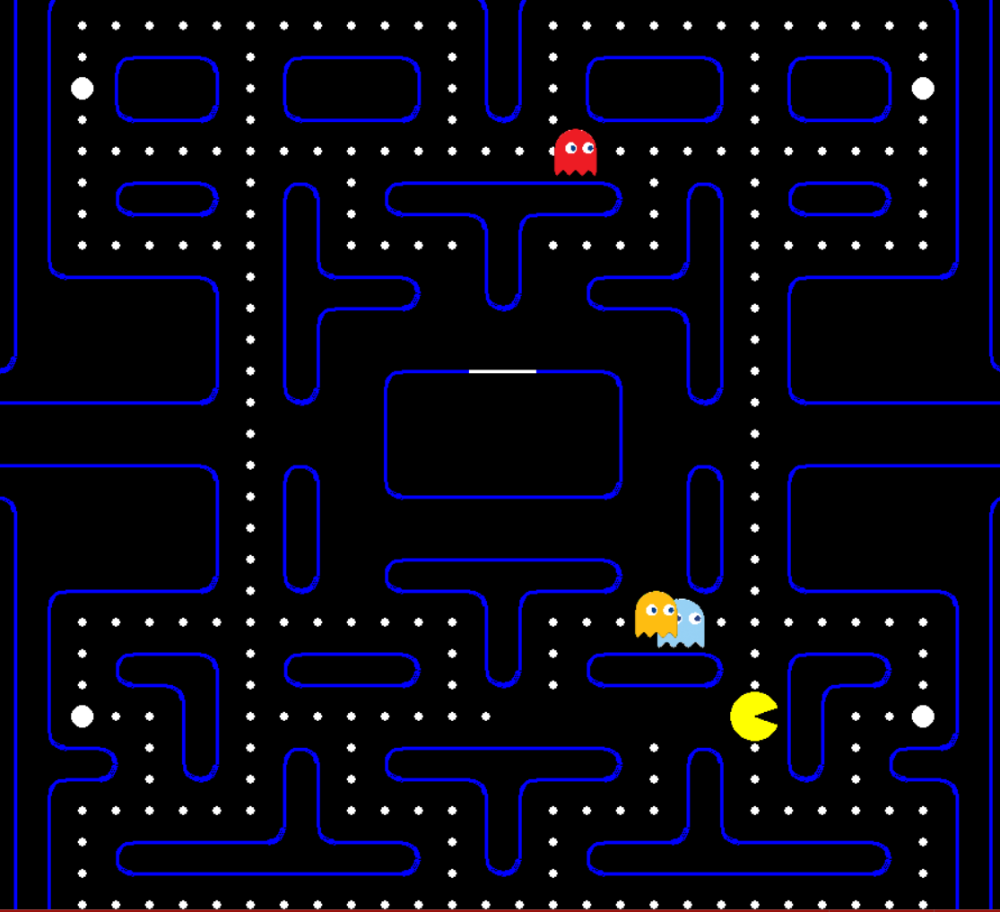

# PacMan

Pacman is a simple game written on Pygame. The game was created as a learning project to explore the possibilities of Pygame and develop game applications.


📝 About The Project
For those of you not familiar with Pacman, it's a game where Pacman moves around in a maze and tries to eat as many food pellets as possible, while avoiding the ghosts. If Pacman eats all the food in a maze, it wins.


## Getting Started

Follow these instructions to get a copy of the project up and running on your local machine for development and testing purposes.

### Prerequisites

- Python 3.x
- Pygame library




### Create and Activate a Virtual Environment

python -m venv myenv
myenv\Scripts\activate  # On Windows
source myenv/bin/activate  # On macOS/Linux
Install Dependencies

### Make sure you have the required dependencies installed:
pip install pygame
Running the Game

### To start the game, run the following command:
python game.py

### Project Structure
- game.py - The main game script.
- assets/ - Directory containing game assets such as images and sounds.
- build/ - Directory for build-related files (if any).
- dist/ - Directory for distribution files (if any).
- myenv/ - Virtual environment directory.

### Usage
Once the game is running, use the following controls (customize as needed):

Arrow keys - Move PacMan
Space - Additional actions (if implemented)

### Contributing
If you would like to contribute to this project, please fork the repository and submit a pull request with your changes. Be sure to include relevant tests and documentation.


### Installation

1. **Clone the Repository**

   ```sh
   git clone https://github.com/yourusername/your-repo-name.git
   cd your-repo-name/PacMan
